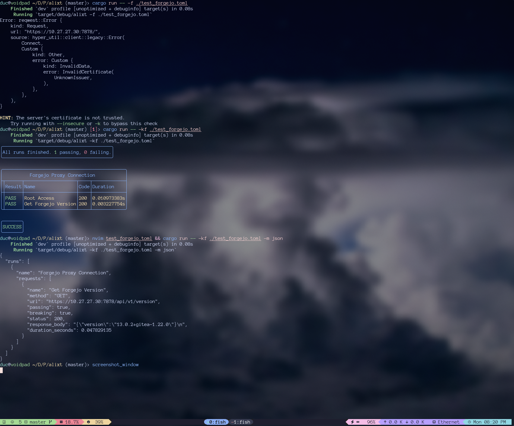
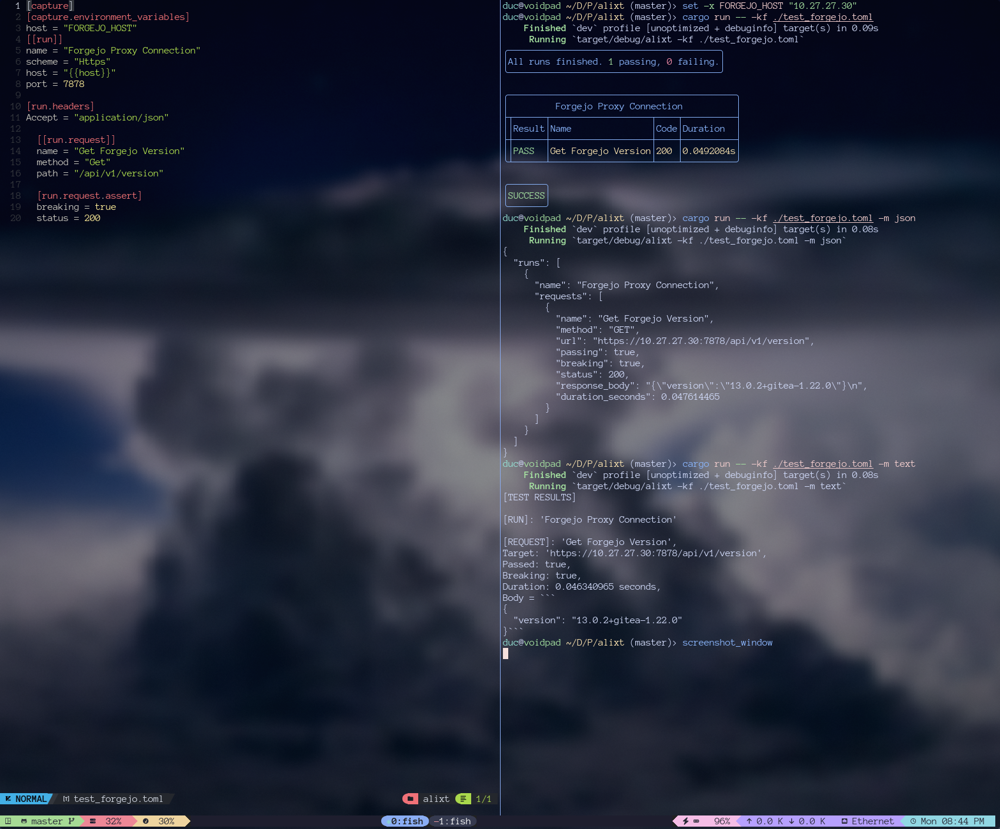

---
## License

This project is licensed under the **GNU General Public License, Version 3.0 or later (GPL-3.0-or-later)**.

The GNU General Public License is intended to guarantee your freedom to share and change all versions of a program—to make sure it remains free software for all its users.

The full terms are available in the included file [LICENSE](LICENSE.txt).

Alternatively, you may view the terms online at <http://www.gnu.org/licenses/>.

